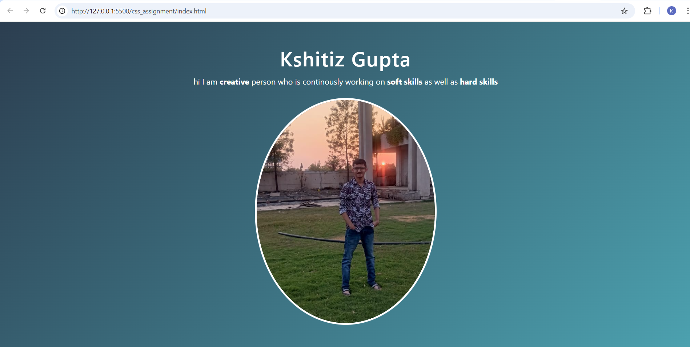
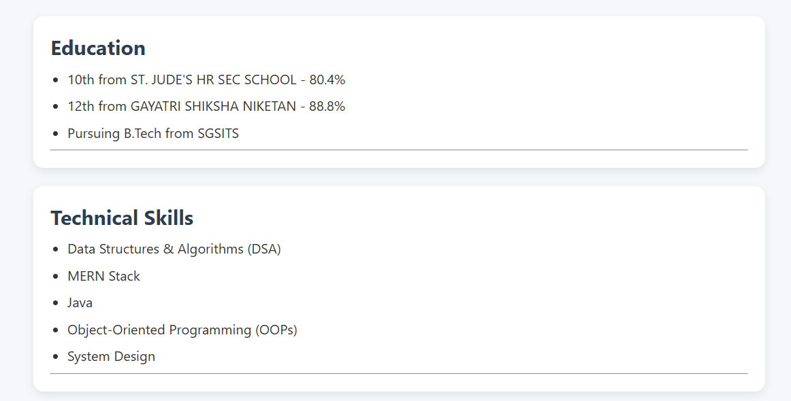
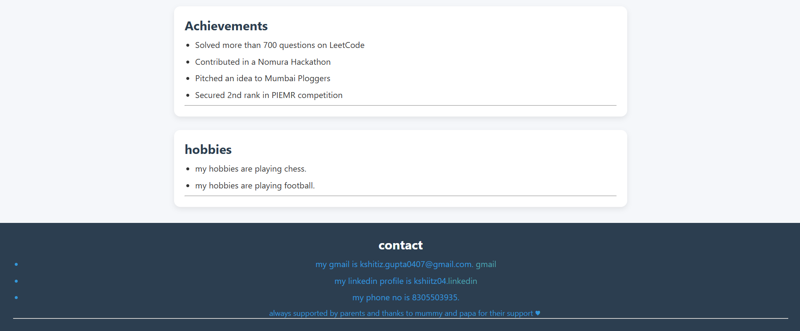

CSS Assignment – Styling & Layout Design

## Project Overview

This assignment focuses on enhancing the visual appearance of a webpage using CSS. The main objective was to transform a basic HTML structure into a well-designed, user-friendly interface by applying styling techniques, layout systems, and responsive design principles.

The project demonstrates how CSS improves user experience by making the interface clean, readable, and visually appealing.

---

## Features Implemented

* Structured and visually organized layout
* Use of Flexbox for alignment and positioning
* Use of CSS Grid for structured sections
* Proper spacing using margin and padding
* Styled buttons with hover effects
* Color combinations for better readability
* Responsive design for different screen sizes
* Section-wise separation for better UI clarity

---

## Technologies Used

* HTML5 (for structure)
* CSS3 (for styling and layout)

---

## Key Concepts Applied

### 1. Flexbox

Used to align elements horizontally and vertically, especially for navigation and content sections.

### 2. CSS Grid

Used to create structured layouts where multiple elements need proper alignment.

### 3. Box Model

Applied margin, padding, and borders to maintain proper spacing and layout.

### 4. Typography & Colors

Used readable fonts and balanced color combinations to improve visual hierarchy.

### 5. Hover Effects

Added hover effects on buttons to enhance interactivity and user experience.

### 6. Responsive Design

Used media queries to ensure the layout works properly on mobile, tablet, and desktop devices.

---

## Screenshots

Below are some screenshots of the project:

### 🔹 Portfolio View 1

### 🔹 Portfolio View 2

### 🔹 Portfolio View 3

## UI Design Explanation

* The layout is divided into clear sections such as header, content, and footer.
* Flexbox is used to maintain alignment and spacing between elements.
* Grid is used where structured layouts are required.
* Colors are chosen to maintain contrast and readability.
* Hover effects provide visual feedback to users.
* The design adapts to different screen sizes using responsive techniques.

---

## Important Notes

* This project focuses only on CSS styling.
* No JavaScript or dynamic functionality is used.
* No external libraries or frameworks (like Bootstrap) are used.
* All styling is done using pure CSS.

---

## How to Run the Project

1. Open the project folder
2. Locate the `index.html` file
3. Open it in any browser (Chrome, Edge, Firefox)

---

## Learning Outcome

Through this assignment, I learned:

* How to structure layouts using Flexbox and Grid
* How to apply styling to improve UI/UX
* How to manage spacing using the box model
* How to create responsive web designs
* How to enhance user interaction using hover effects

---

## Conclusion

This assignment helped me understand how CSS plays an important role in making web pages visually appealing and user-friendly. It also improved my understanding of layout techniques and responsive design, which are essential skills in frontend development.
---
