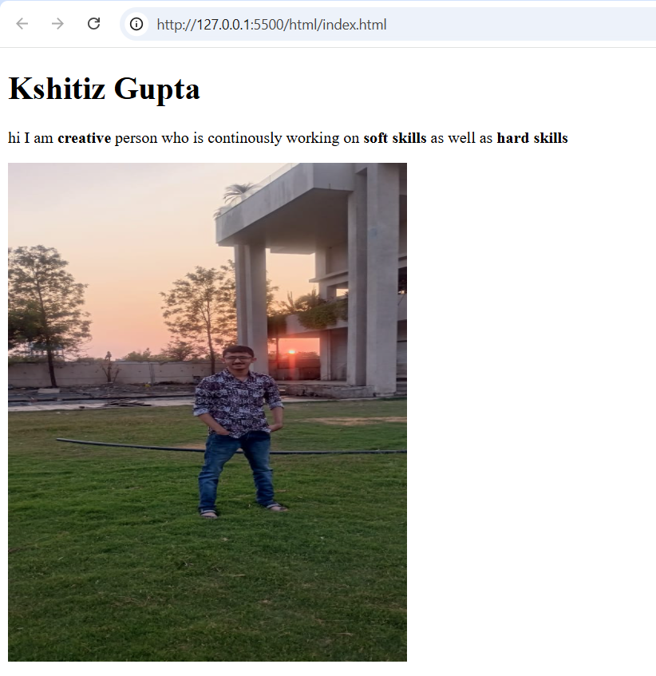
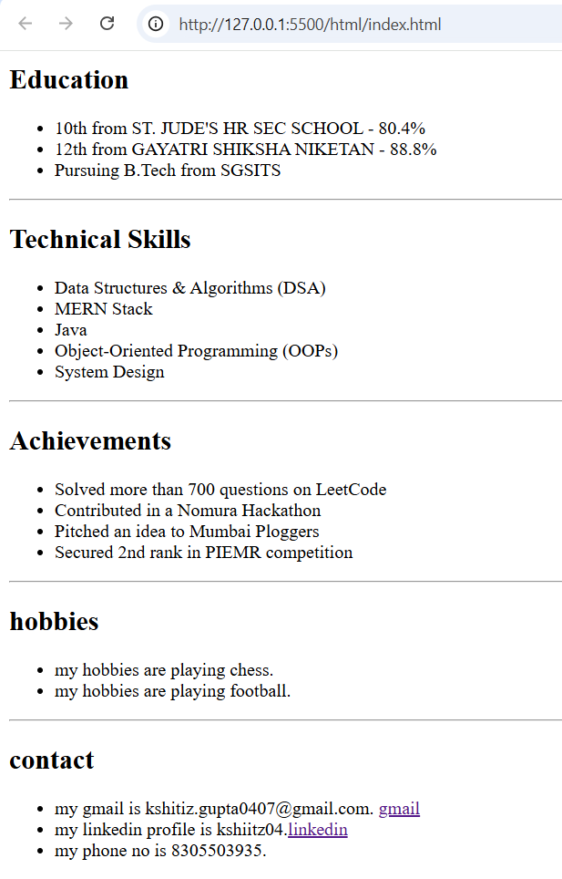
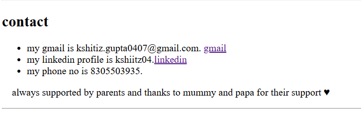

# Personal Portfolio (HTML)

## Description

This project is a **personal portfolio webpage** created using only **HTML**.
It represents my basic introduction, education, skills, achievements, hobbies, and contact information.

The objective of this assignment was to learn:

* HTML structure
* Semantic tags
* Lists, links, and images
* Organizing content properly

---

## Features

* Structured webpage using semantic tags
* Header section with introduction and image
* Education section
* Technical Skills section
* Achievements section
* Hobbies section
* Contact details with links

---

## Technologies Used

* HTML5

---

## Project Structure

```
project-folder/
│── index.html
│── Kshitizpho.jpeg
│── README.md
```

---

## How to Run

1. Download or clone the repository
2. Open `index.html` in any web browser

---

## Achievements Mentioned

* Solved 700+ problems on LeetCode
* Participated in Nomura Hackathon
* Pitched an idea to Mumbai Ploggers
* Secured 2nd rank in PIEMR competition

---

## Screenshot
### 🔹 Portfolio View 1


### 🔹 Portfolio View 2


### 🔹 Portfolio View 3


## Acknowledgement

I am thankful to my parents for their continuous support ❤️.

---

## Note
This project is created as part of my HTML assignment and learning journey.
