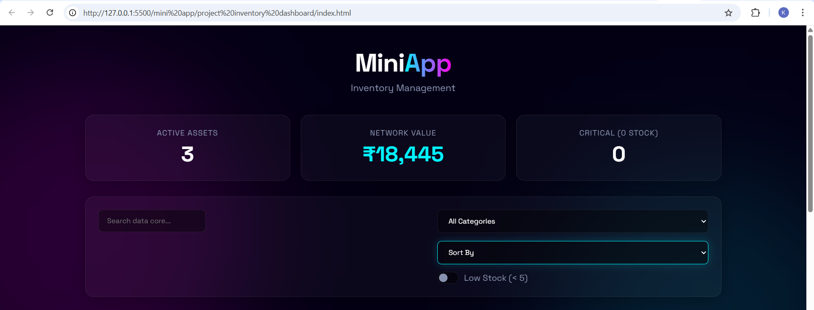
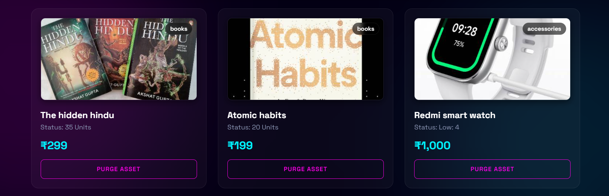
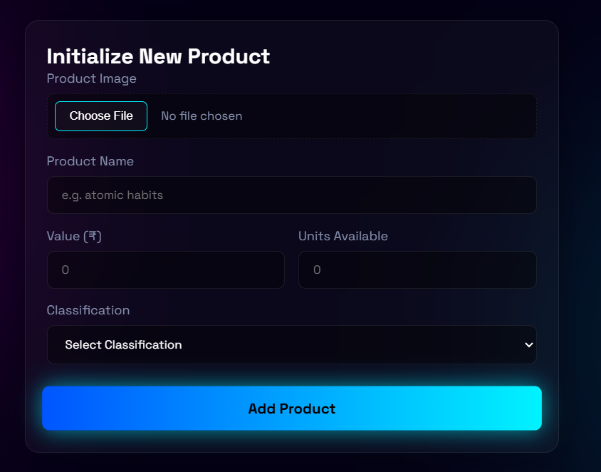
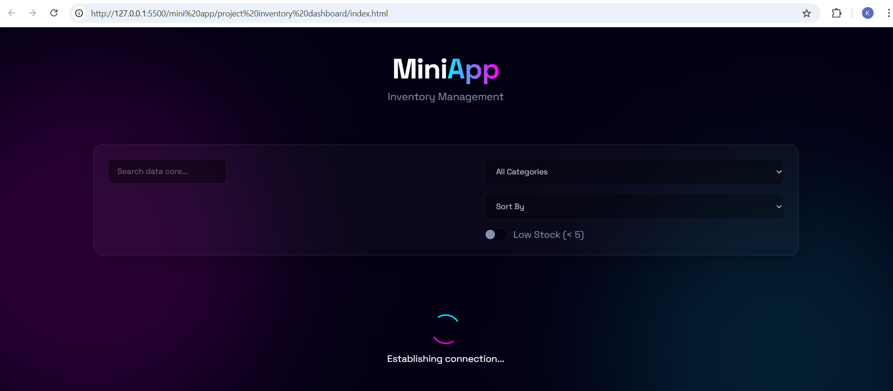

# Product Inventory Dashboard

## Project Overview
The **Product Inventory Dashboard** is a dynamic front-end web application designed to manage and track products efficiently.

This project is built entirely using **pure HTML, CSS, and JavaScript**, without using any external frameworks or libraries.

To enhance the visual experience, I implemented a custom **"Cyber-Aurora Glass" UI theme**, featuring:
- Dark mode interface 🌙  
- Animated background orbs  
- Glassmorphism panels  
- Neon hover effects  

---

## Key Features

### Dynamic Product Rendering
- All product cards are generated dynamically using JavaScript.

### Inventory Analytics
- Displays:
  - Total Products  
  - Total Inventory Value (₹)  
  - Out-of-Stock Items  

### Advanced Filtering & Sorting
- Live search by product name  
- Category filter dropdown  
- Low stock toggle (< 5 items)  
- Sorting options:
  - Price (Low → High / High → Low)
  - Alphabetical (A-Z / Z-A)

### Product Management
- Add new products via validated form  
- Delete existing products  

### Image Handling & Compression
- Upload product images  
- Images are compressed using **HTML5 Canvas**
- Stored as lightweight **Base64 strings**

### 🔹 Data Persistence
- Uses **localStorage** to store inventory data  
- Data remains even after page reload  

### 🔹 Simulated API Loading
- Uses **Promises + setTimeout()**
- Shows custom loader for **1.5 seconds**

---

## Screenshots

### First Image


### Second Image


### Third Image


### Fourth Image


## Technologies Used

- **HTML5** – Structure and forms  
- **CSS3** – Styling (Grid, Flexbox, Glassmorphism, Animations)  
- **JavaScript (ES6+)** – Logic and functionality  

Key concepts used:
- DOM Manipulation  
- Array methods (`filter`, `sort`, `reduce`)  
- Event Listeners  
- Promises  
- FileReader API  

---

## Project Structure

```text
frontend/
├── mini_app/
│   └── product_inventory_dashboard/
│       ├── css/
│       │   └── style.css
│       ├── js/
│       │   └── script.js
│       ├── index.html
│       └── README.md