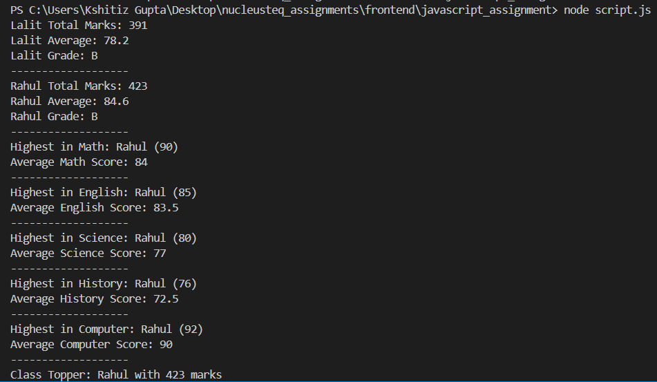

# Student Performance Analyzer

## Description
This project analyzes student marks using JavaScript.

## Features
- Total marks calculation
- Average marks
- Subject-wise highest & average
- Class topper
- Grade system with fail conditions

## Output Screenshots
(Add screenshots here)

## Logic Explanation
- Used array of objects to store students
- Used loops to iterate data
- Functions used for modular coding

## Class Topper Result
This output shows that Rahul is the topper with highest marks.

